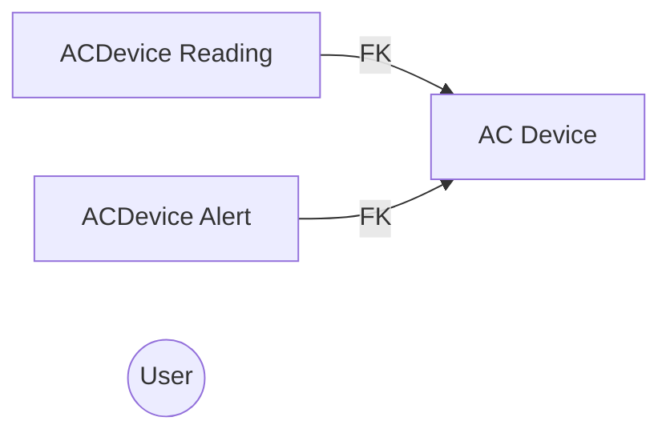

# Smart AC Prototype

Create a proof of concept for Smart AC Devices.  These devices have sensors for Temperature, CO Levels, Humidity and a General Health Status.  The devices need to send these readings, either one at a time or as part of a batch, to a central locations.  This Prototype exposes an HTTP API for these smart devices and provides an admin dashboard for users to view the devices and their stats.

## Evolution of the project.
Pretty much everything is "happy path" with not a lot of UX or Data validation testing.  I had originally thought to use Python/Django/Postgres/AWS Lambda, but since I was being evaluated on C# I switched to .net core 2.0.  It took quite a bit of patience to get the initial setup in azure working and connecting to the database.  I had initially though it would make sense to use Azure Function Apps for the Device API.  Developing the function app was really straight forward and worked well enough, but I opted to scrap it.  I didn't like how it created the URLs.  Debugging and troubleshooting the Function Apps was also painful.  The final api is just a controller in the asp.net project.

Once things were setup in Azure, the process felt pretty natural and honestly was kind of refreshing to be back in .NET land.  Most of the FE is developed just using server side rendering and Bootstrap/JQuery.  With the introduction of the Notification System, I think it would be much better developed using a proper frontend framework like React, which can handle state management properly.  I didn't have time to do all the requirements.  I've outlined below what I believe is complete and what is missing.  Back in the day, the asp.net starter template included all the user management stuff.  I couldn't find such a thing for asp.net core mvc.  I felt that the other requirements for this prototype were more important that user management.

## Features and Priorities
The features that I understand from the doc are
1. HTTP end point(s) to collect the data. (I think these are all a Must Have)
	A) Registration
	B) Data collection every minute
	C) Bulk data collection needs to be supported
2. Web Admin
	A) Login and manage users. Invite other users
	B) List and search for devices
	C) Visualize a devices data
	D) Notify uses based on status or CO levels.
I'd prioritize these like this.
#### Priorities
1 (we should have all of this)
2B -> 2C -> 2D -> 2A

## Completed Requirements
- API:  Register Devices.  Records 1 or more Readings. The complete api usage can be found at [https://smartacfe2.azurewebsites.net/api](https://smartacfe2.azurewebsites.net/api)
- Web App  [https://smartacfe2.azurewebsites.net/AdminPanel](https://smartacfe2.azurewebsites.net/AdminPanel/)
	- Login / Out  [https://smartacfe2.azurewebsites.net/Account/Login](https://smartacfe2.azurewebsites.net/Account/Login)
	- List All Devices 
	- Search by Serial Number
	- View Device Details.  Show's the latest reading as well as trend graphs for the Temperature, Humidity and CO Levels
	- Notifications.  The Web App will ping the back end every 10 seconds and display any uncleared notifications at the top of the current page.  Notifications must be cleared or they will keep showing up.

## Missing Features
Not including these features really just came down to me running out of time and wanting to finish things that were a higher priority.  All of these features fall into the lowest priority (2A from above).  As long as there was a way for users to login and new users to register, I felt that the rest of the app was usable.  Previously, the ASP.NET MVC Starter Project came with the User authentication, Roles and password forgot/reset out of the box.  I couldn't find such a template for .NET Core MVC.  I think it's worth it to keep looking though.
- Recovering/Resetting Passwords
- Inviting other users.  (There is a registration feature though)
- List users, enable/disable option

## Data Definition
### User
Field Name|Type|Required|Description
-------------|------|--------|---------
ID|Int32|Yes|Auto Increment, Primary Key
Username|String|Yes|Should be an email address
FirstName|String|No|
LastName|String|No|

### ACDevice
Field Name|Type|Required|Description
-------------|------|--------|---
ID|Int32|Yes|Auto Increment-PrimaryKey
SerialNumber|String|Yes|Unique serial number of the device
FirmwareVersion|String|Yes|Firmware Version of the device
RegistrationDate|DateTime|Yes|Autopopulated with the current date when a device registers
AccessKey|String|No|Generated access key that clients should use when sending readings for this device

### ACDeviceReading
Field Name|Type|Required|Description
-------------|------|--------|---
ID|Int32|Yes|Auto Increment - Primary Key
ACDeviceID|Int32|Yes|Foreign Key to ACDevice
Temperature|Decimal|No|Temperature reading in Celsius
COLevel|Decimal|No|Carbon Monoxide level in parts per million
Humidity|Decimal|No|Humidity as a percentage
HealthStatus|String|No|Current status of the device  *should be an enum*
ReadingDateTime|DateTime|Yes|Client supplied timestamp for the readings
LoggedDateTime|DateTime|Yes|System populated timestamp represents when the reading was sent to the system

### ACDeviceAlert
Field Name|Type|Required|Description
-------------|------|--------|---
ID|Int32|Yes|Auto Increment - Primary Key
ACDeviceID|Int32|Yes|Foreign Key to ACDevice
DeviceAlertType|Int32|Yes|Enum of HEALTH_STATUS=0, CO_LEVEL=1
ReadingDateTime|DateTime|Yes|Timestamp of the reading that caused the alert
AlertDateTime|DateTime|Yes|System populated timestamp representing when the reading was sent that triggered the alert
Cleared|Boolean|No|Boolean indicating that the alert has been cleared

## ERD

